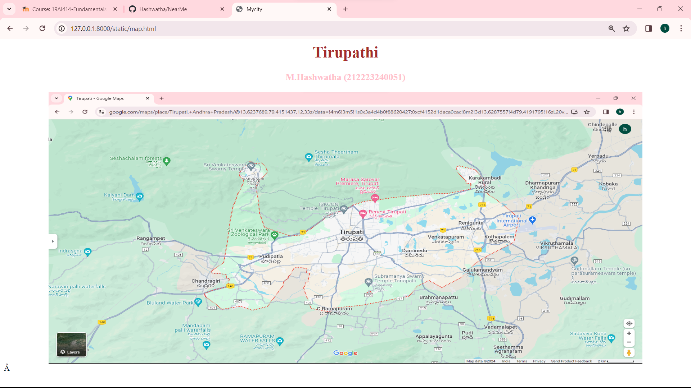

# Ex04 Places Around Me
## Date: 01/04/2024

## AIM
To develop a website to display details about the places around my house.

## DESIGN STEPS

### STEP 1
Create a Django admin interface.

### STEP 2
Download your city map from Google.

### STEP 3
Using ```<map>``` tag name the map.

### STEP 4
Create clickable regions in the image using ```<area>``` tag.

### STEP 5
Write HTML programs for all the regions identified.

### STEP 6
Execute the programs and publish them.

## CODE

```
<html>
    <title>Mycity</title>
    <body bgcolor="white">
        <h1 align="center"><font color="brown">Tirupathi</font></h1>
        <h3 align="center">
            <font color="Pink">M.Hashwatha (212223240051)</font></h3>
        <center>
            
            <map name="MyCity">
                    <area shape="rect" coords="360,230,410,260" href="Park.html" title="Sri Venkateswara Zoological Park">     
                    <area shape="rect" coords="750,270,840,350" href="Isckon.html" title="Isckon temple">
                    <area shape="rect" coords="400,600,510,650" href="Waterfalls.html" title="Ramapuram Waterfalls">
                    <area shape="rect" coords="1100,240,900,300" href="Dam.html" title="Kalyani Dam">
                    <area shape="rect" coords="810,300,750,350" href="forest.html" title="Seshachalam forest">
        </center>
       

    </body>
</html>

## park 

<html>
    <h1 align="center">
        <font face="Times New Roman" color="black" size="6">Tirupathi</font>
    </h1>
    <h3 align="center">
        <font face="Times New Roman" color="Purple" size="5.5">Sri Venkateswara Zoological Park</font>
    </h3>
    <body bgcolor="lavender" align="center">
        <hr size="5" color="white">
        <p align="center">
        <font face="Times New Roman" size="5.5">
            Sri Venkateswara Zoological Park, located near Tirupati in Andhra Pradesh, India, is one of the largest zoological parks in Asia. 
            It was established in 1987 and covers an area of about 5532 acres. The park is named after Lord Venkateswara, a form of the Hindu god Vishnu, who is worshipped at the nearby Tirumala Venkateswara Temple.
        </font>
        </p>
    </body>
</html>

## Isckon temple

<html>
    <h1 align="center">
        <font face="Times New Roman" color="black" size="6">Tirupathi</font>
    </h1>
    <h3 align="center">
        <font face="Times New Roman" color="Purple" size="5.5">Isckon temple</font>
    </h3>
    <body bgcolor="lavender" align="center">
        <hr size="5" color="white">
        <p align="center">
        <font face="Times New Roman" size="5.5">
            It seems like you're asking about the ISKCON temple in Tirupati.
            ISKCON stands for the International Society for Krishna Consciousness, a religious organization focused on the worship of Lord Krishna.
            In Tirupati, there is indeed an ISKCON temple known as the Sri Sri Radha Govinda Mandir.
            The temple is located near Alipiri in Tirupati, Andhra Pradesh, India. 
            It is one of the prominent attractions for devotees and tourists alike in the area.
        </font>
        </p>
    </body>
</html>

## waterfalls

<html>
    <h1 align="center">
        <font face="Times New Roman" color="black" size="6">Tirupathi</font>
    </h1>
    <h3 align="center">
        <font face="Times New Roman" color="Purple" size="5.5">Ramapuram Waterfalls</font>
    </h3>
    <body bgcolor="lavender" align="center">
        <hr size="5" color="white">
        <p align="center">
        <font face="Times New Roman" size="5.5">
            As of my last update in January 2022, there isn't a widely recognized waterfall by the name "Ramapuram Waterfalls" in Tirupati, Andhra Pradesh, India.
            It's possible that it could be a local or lesser-known waterfall that hasn't gained widespread attention. 
            If it's a newly discovered or named waterfall, you may want to check with local tourism authorities or explore local travel resources for more information about its location, accessibility, and any associated attractions or amenities.
        </font>
        </p>
    </body>
</html>

## dam

<html>
    <h1 align="center">
        <font face="Times New Roman" color="black" size="6">Tirupathi</font>
    </h1>
    <h3 align="center">
        <font face="Times New Roman" color="Purple" size="5.5">Kalyani Dam</font>
    </h3>
    <body bgcolor="lavender" align="center">
        <hr size="5" color="white">
        <p align="center">
        <font face="Times New Roman" size="5.5">
            As of my last update in January 2022, there isn't a widely recognized dam named "Kalyani Dam" in Tirupati, Andhra Pradesh, India.
            However, it's possible that there may have been developments or construction of new dams since then.
            If "Kalyani Dam" is a newly constructed or renamed dam, I recommend checking local government sources, tourism websites, or recent travel guides for the most accurate and up-to-date information about it.
        </font>
        </p>
    </body>
</html>

## Forest

<html>
    <h1 align="center">
        <font face="Times New Roman" color="black" size="6">Tirupathi</font>
    </h1>
    <h3 align="center">
        <font face="Times New Roman" color="Purple" size="5.5">Seshachalam forest</font>
    </h3>
    <body bgcolor="lavender" align="center">
        <hr size="5" color="white">
        <p align="center">
        <font face="Times New Roman" size="5.5">
            The Seshachalam Forest is located near Tirupati in the Chittoor district of Andhra Pradesh, India. 
            It is renowned for its rich biodiversity, comprising various flora and fauna species. 
            The forest is also home to the sacred Tirumala Hills, which are an important pilgrimage site for Hindus, particularly due to the presence of the renowned Venkateswara Temple, also known as the Tirumala Temple.
        </font>
        </p>
    </body>
</html>

```
## OUTPUT




## RESULT
The program for implementing image maps using HTML is executed successfully.
